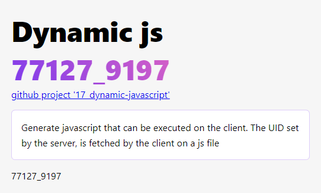

# 17_dynamic-javascript
[../17_dynamic-javascript](../17_dynamic-javascript)

Generate javascript that can be executed on the client. The UID set by the server, is fetched by the client inside a javascript file

Note : although functional, this method is not recommended due to Vite complaning about dynamic import and security risk it implies.

