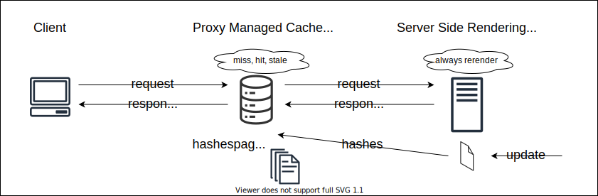

# 18_ssr-cache
[../18_ssr-cache](../18_ssr-cache)

* adapter : node-standalone
* proxy   : express

Running mode :

* astro starts with `pnpm run preview` listens on port 4000
* express starts with `pnpm run proxy` listens on port 3000
* first client page load from proxy : cache miss, proxy fetches data from SSR
* SSR generates the page and and on creation assigns a page hash
* for the example purpose a 2 seconds timeout is added to a page render
* the page hash is updated on the proxy (in the example through a shared `hashes.json` but could be with a db or API)
* when the proxy fetches the page it identifies the cached page with its hash (as it is always actual on the `hashes.json`)
* follow up request checks if page is available and if hash is fresh
* when the user updates the data, the server updates the page hash
* follow up requests on the proxy show the page to be stale due to old cached page, the proxy fetches the page with the new hash

