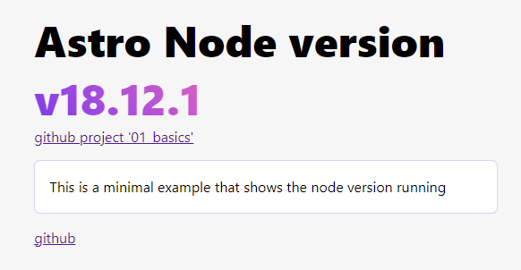
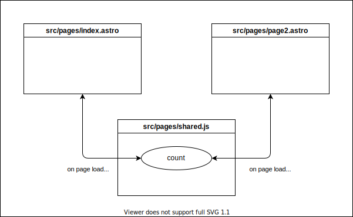
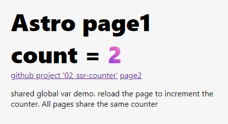
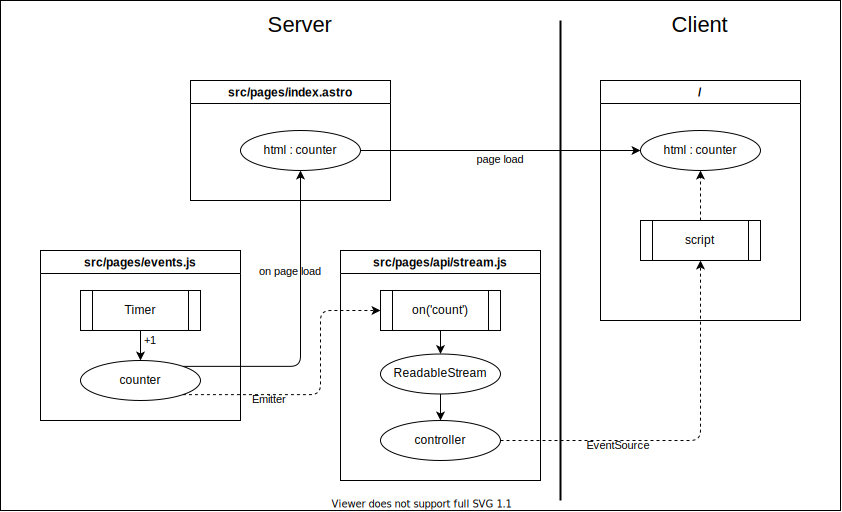
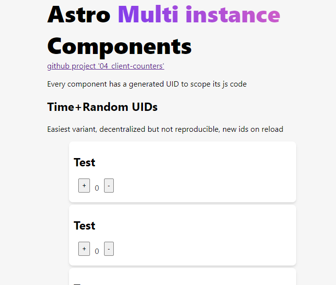
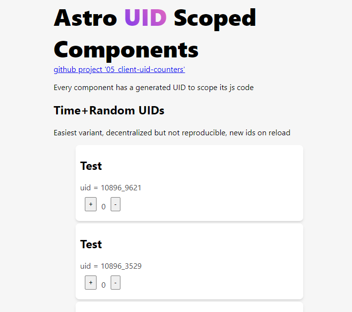
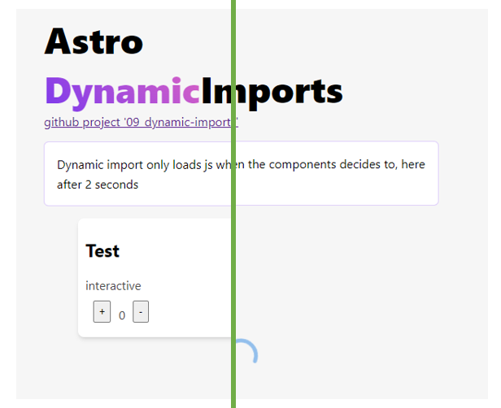
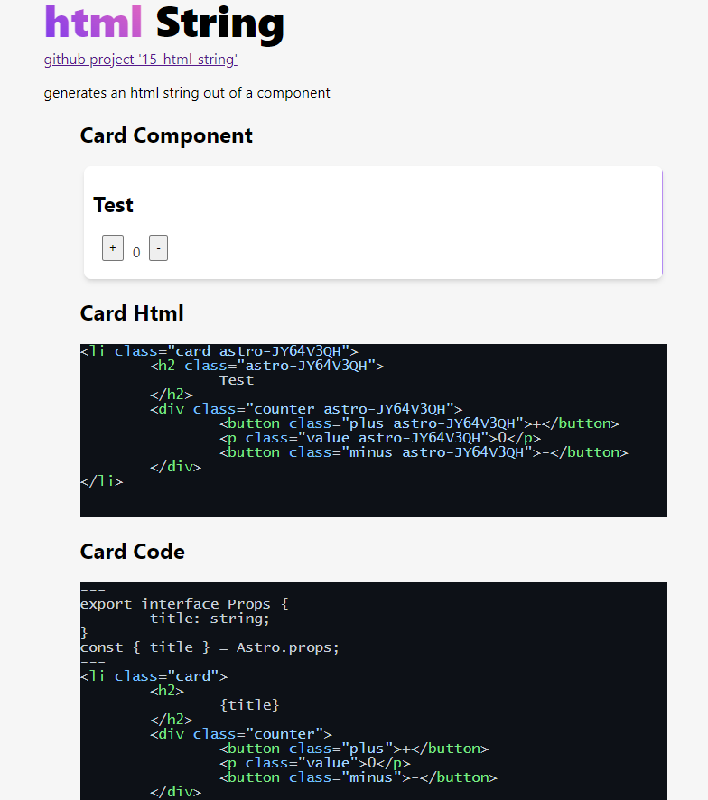
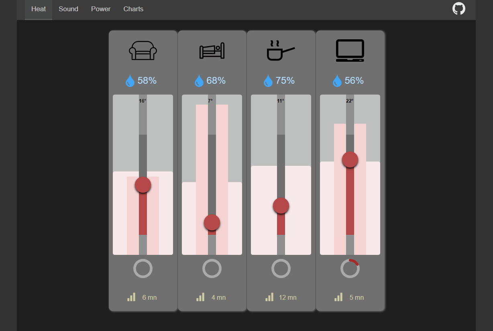

showcase examples for isolated simple usage patterns


# 01_basics
[./01_basics](./01_basics)

This is a minimal example that shows the node version running

* Layout [Slots](https://docs.astro.build/en/core-concepts/astro-components/#slots)
* Note bumped to Astro v3 beta which discarded Node 16




[](https://codesandbox.io/s/github/MicroWebStacks/astro-examples/tree/main/01_basics)
[](https://gitpod.io/?on=gitpod#https://github.com/MicroWebStacks/astro-examples/tree/main/01_basics)


# 02_ssr-counter
[./02_ssr-counter](./02_ssr-counter)

* integration : [@astrojs/node](https://docs.astro.build/en/guides/integrations-guide/node/)
* adapter : node-standalone

shared global var demo. reload the page to increment the counter. All pages share the same counter





* SSR Memory profiling, run with `python test.py`

output with the page being loaded from a browser and switching pages
```
Server listening on http://127.0.0.1:3000
Max memory consumption: 4.44 MB
Max memory consumption: 51.71 MB
Max memory consumption: 51.71 MB
Max memory consumption: 54.93 MB
```


[](https://stackblitz.com/github/MicroWebStacks/astro-examples/tree/main/02_ssr-counter)
[](https://codesandbox.io/s/github/MicroWebStacks/astro-examples/tree/main/02_ssr-counter)
[](https://gitpod.io/?on=gitpod#https://github.com/MicroWebStacks/astro-examples/tree/main/02_ssr-counter)


# 03_sse-counter
[./03_sse-counter](./03_sse-counter)

* integration : [@astrojs/node](https://docs.astro.build/en/guides/integrations-guide/node/)
* adapter : node-standalone
* [Server Endpoints](https://docs.astro.build/en/core-concepts/endpoints/#server-endpoints-api-routes)
* [ReadableStream](https://developer.mozilla.org/en-US/docs/Web/API/ReadableStream)
* remove Listener on cancel () thanks to https://github.com/0xk1f0/astro-sse-example

SSE: Server Sent Events. global var using a timer and Emitter

Server keeps couter state. reloading the page has no effect on the counter

requires Node18 for ReadableStream(), currently only on Gitpod




[](https://gitpod.io/?on=gitpod#https://github.com/MicroWebStacks/astro-examples/tree/main/03_sse-counter)

# 04_client-counters

[./04_client-counters](./04_client-counters)

A simple approach for multiple instances of a component. A `<script>` is included once. It initiates all components of a class on page load without requiring unique identification

* Card [Astro Component](https://docs.astro.build/en/core-concepts/astro-components/)
    * [Client-side Scripts](https://docs.astro.build/en/core-concepts/astro-components/#client-side-scripts)
    * [Css Styles](https://docs.astro.build/en/core-concepts/astro-components/#css-styles)




[](https://stackblitz.com/github/MicroWebStacks/astro-examples/tree/main/04_client-counters)
[](https://codesandbox.io/s/github/MicroWebStacks/astro-examples/tree/main/04_client-counters)
[](https://gitpod.io/?on=gitpod#https://github.com/MicroWebStacks/astro-examples/tree/main/04_client-counters)


# 05_client-uid-counters
[./05_client-uid-counters](./05_client-uid-counters)

Decentralized scoping js execution on an Astro component used mutiple times on the same page

* integration : [@astrojs/node](https://docs.astro.build/en/guides/integrations-guide/node/)
* adapter : node-standalone

Constraints :
* decentralized : not conflicting with multiple integrations using the same concept
* no global state management : which is not easy to fulfill when using components from different sources
* multi instances used on the same page
* components handle their own js scripts
* each component has a lifecylce independence and its js only handles its own html and not one of other instances

Alternatives:
* It is always possible to initialize all components from the top page js, but sometimes the js component code is preferrably placed within the component itself.
* It is also possible within the component to have the code run on all components in the page of the same type, but this does not fit with lazy loading where each component has to be initialize separately
* It is still possible to keep a component state in the window or as html attribute and still run init on all components everytime a new one wakes up, but this might incur incompatibilities when mixing versions
* A centralized approach is also demonstrated but not recommend due to flaws that might happen when the `sequence_uid` function gets multiple instances for some reason such as being budled separately.

Optionally:
* a hash function could be used if an unidentifieable id is desired that does not reflect the user input (using counting numbers or names,...), if the input data is too big such as complete file or if the uid is required to always have the same consistent format e.g. number of characters which the user cannot guarantee.



[](https://stackblitz.com/github/MicroWebStacks/astro-examples/tree/main/05_client-uid-counters)
[](https://codesandbox.io/s/github/MicroWebStacks/astro-examples/tree/main/05_client-uid-counters)
[](https://gitpod.io/?on=gitpod#https://github.com/MicroWebStacks/astro-examples/tree/main/05_client-uid-counters)

# 07_env-config
[./07_env-config](./07_env-config)

using environment variables from file in `astro.config.mjs` and `.js` server files

* integration : [@astrojs/node](https://docs.astro.build/en/guides/integrations-guide/node/)
* adapter : node-standalone
* [dotenv](https://github.com/motdotla/dotenv#readme)


* todo test with loadEnv from 'vite'

[](https://stackblitz.com/github/MicroWebStacks/astro-examples/tree/main/07_env-config)
[](https://codesandbox.io/s/github/MicroWebStacks/astro-examples/tree/main/07_env-config)
[](https://gitpod.io/?on=gitpod#https://github.com/MicroWebStacks/astro-examples/tree/main/07_env-config)

# 08_404-error-handling
[./08_404-error-handling](./08_404-error-handling)

Page not found redirect to 404

* integration : [@astrojs/node](https://docs.astro.build/en/guides/integrations-guide/node/)
* output server
    * adapter : node-standalone
* output static
* [dotenv](https://github.com/motdotla/dotenv#readme)
* [Custom 404 Error page](https://docs.astro.build/en/core-concepts/astro-pages/#custom-404-error-page)
* Dynamic Route with [Rest parameters](https://docs.astro.build/en/core-concepts/routing/#rest-parameters) `[...path].astro`

[](https://stackblitz.com/github/MicroWebStacks/astro-examples/tree/main/08_404-error-handling)
[](https://codesandbox.io/s/github/MicroWebStacks/astro-examples/tree/main/08_404-error-handling)
[](https://gitpod.io/?on=gitpod#https://github.com/MicroWebStacks/astro-examples/tree/main/08_404-error-handling)

custom 404 page from : https://codepen.io/Stephane/pen/Jdozrp

# 09_dynamic-imports
[./09_dynamic-imports](./09_dynamic-imports)

* integration : [@astrojs/node](https://docs.astro.build/en/guides/integrations-guide/node/)
* adapter : node-standalone
* Deferr loading of js on event or timeout
    * `setTimeout`
    * [Dynamic import()](https://developer.mozilla.org/en-US/docs/Web/JavaScript/Reference/Operators/import)
    * Spinner while waiting : Astro Component with animated SVG

This is about dynamically importing a js script only when the component logic decides to do it. In this case, after 2 seconds from window load.

Not only `<Card title="Test" client:visible/>` is not supported by astro as directive reserved for framework components only, but also, it does not give fine granularity to decide exactly when to load a js script.

Note: Testing this example only makes sense in production mode (with build and run). Only gitpod left because it has a shell script that builds and runs by default while the others (StackBliz and Codesandbox) run in preview mode.



[](https://gitpod.io/?on=gitpod#https://github.com/MicroWebStacks/astro-examples/tree/main/09_dynamic-imports)

# 10_prerender
[./10_prerender](./10_prerender)

This example uses the experimental `prerender` feature. index page `'/'` is prerendered while `'/rerender'` page is server side rendered on every fetch

* integration : [@astrojs/node](https://docs.astro.build/en/guides/integrations-guide/node/)
* adapter : node-standalone
* [Hybrid Rendering](https://docs.astro.build/en/guides/server-side-rendering/#hybrid-rendering) with `export const prerender=true`


[](https://stackblitz.com/github/MicroWebStacks/astro-examples/tree/main/10_prerender)

# 11_deno-env
[./11_deno-env](./11_deno-env)

* integration : [deno](https://docs.astro.build/en/guides/integrations-guide/deno/)
* adapter : deno

Testing environment variables in deno and deno.deploy

live demo : https://astro-env.deno.dev/

project : https://dash.deno.com/projects/astro-env


[](https://codesandbox.io/s/github/MicroWebStacks/astro-examples/tree/main/11_deno-env)
[](https://gitpod.io/?on=gitpod#https://github.com/MicroWebStacks/astro-examples/tree/main/11_deno-env)


# 12_content-collections
[./12_content-collections](./12_content-collections)

* markdown with image optimization
* using node standalone
* [Content Collections](https://docs.astro.build/en/guides/content-collections/)
    * get all frontmatter meta data with [getCollection()](https://docs.astro.build/en/reference/api-reference/#getcollection)
    * rendering of multiple Markdown pages in one page with `await Promise.all()` and [item.render()](https://docs.astro.build/en/reference/api-reference/#render)
    * Single pages rendering in a dynamic path `[...slug].astro` with [getEntryBySlug()](https://docs.astro.build/en/reference/api-reference/#getentrybyslug)

[](https://stackblitz.com/github/MicroWebStacks/astro-examples/tree/main/12_content-collections)
[](https://codesandbox.io/s/github/MicroWebStacks/astro-examples/tree/main/12_content-collections)
[](https://gitpod.io/?on=gitpod#https://github.com/MicroWebStacks/astro-examples/tree/main/12_content-collections)

- https://freesvg.org/1542512156 : tree

# 13_client-cookie-counter
[./13_client-cookie-counter](./13_client-cookie-counter)

* integration : [@astrojs/node](https://docs.astro.build/en/guides/integrations-guide/node/)
* adapter : node-standalone
* Astro API [Astro.cookies.get()](https://docs.astro.build/en/guides/server-side-rendering/#astrocookies)


This counter uses a cookie `counter=1` to persist through pages relaod despite being a client counter.

For Astro SSR there is a simplicity advantage for using a cookie over using client sotrage :
* Automatically sent with every client request
* No display flicker
* no need to create a server endpoint to submit the client updated value (to avoid the flicker)

Note : Only a single counter is used in this example given that a single cookie is used

Note : For a demo using cookies, the Astro.cookies could only be read in Gitpod

[](https://gitpod.io/?on=gitpod#https://github.com/MicroWebStacks/astro-examples/tree/main/13_client-cookie-counter)

## references
* https://stackoverflow.com/questions/73341205/why-does-the-icon-in-this-astro-svelte-component-flicker-on-refresh/74873656#74873656

* todo : check example with blocking head script can solve ssg

# 14_client-storage-counter
[./14_client-storage-counter](./14_client-storage-counter)

* This counter is using `sessionStorage` for client side persistency, and therefore avoids cookies.
* For UI sensitive elements (such as menu, sidebar, modal,...) it is important to prevent flicker. Such Flicker can happen when the server sends a default value upon page refresh and then javascript adjusts the value after reading it from the session sotrage. To prevent that, every time the client changes the value, the server state needs to be updated through a `put` request to a server endpoint
* For the server to know which client has whic counter, a counters map for each session_id is stored
* The session ID is created by the server when a request URL does not contain `session_id` parameter, it is passed to the client within the html components, the client takes it upon page load and use it in case no sessionStorage session_id available. Then stick it to the URL parameters for future queries

Note : this implementation is for demo purpose only and suffers from memory leak as old session_id's are not deleted.

[](https://stackblitz.com/github/MicroWebStacks/astro-examples/tree/main/14_client-storage-counter)
[](https://codesandbox.io/s/github/MicroWebStacks/astro-examples/tree/main/14_client-storage-counter)
[](https://gitpod.io/?on=gitpod#https://github.com/MicroWebStacks/astro-examples/tree/main/14_client-storage-counter)

## references
* https://stackoverflow.com/questions/73341205/why-does-the-icon-in-this-astro-svelte-component-flicker-on-refresh/74873656#74873656

# 15_server-cookie-counter
[./15_server-cookie-counter](./15_server-cookie-counter)

* adapter : node-standalone

Counts the pages load for a specific client with cookies. This examples shows how to get and set a cookie from a .astro page while example 13 gets the cookie from the server and set it from the client. 

[](https://stackblitz.com/github/MicroWebStacks/astro-examples/tree/main/15_server-cookie-counter)
[](https://codesandbox.io/s/github/MicroWebStacks/astro-examples/tree/main/15_server-cookie-counter)
[](https://gitpod.io/?on=gitpod#https://github.com/MicroWebStacks/astro-examples/tree/main/15_server-cookie-counter)

# 16_html-string
[./16_html-string](./16_html-string)

example to show how to generate an html string out of a component using a Wrapper and `Astro.slots.render()`



[](https://stackblitz.com/github/MicroWebStacks/astro-examples/tree/main/16_html-string)
[](https://codesandbox.io/s/github/MicroWebStacks/astro-examples/tree/main/16_html-string)
[](https://gitpod.io/?on=gitpod#https://github.com/MicroWebStacks/astro-examples/tree/main/16_html-string)

## references
* https://stackoverflow.com/questions/73382889/how-can-i-render-a-astro-component-to-a-html-string/74853279#74853279


# 17_dynamic-javascript
[./17_dynamic-javascript](./17_dynamic-javascript)

Generate javascript that can be executed on the client. The UID set by the server, is fetched by the client inside a javascript file

Note : although functional, this method is not recommended due to Vite complaning about dynamic import and security risk it implies.


[](https://stackblitz.com/github/MicroWebStacks/astro-examples/tree/main/17_dynamic-javascript)
[](https://codesandbox.io/s/github/MicroWebStacks/astro-examples/tree/main/17_dynamic-javascript)
[](https://gitpod.io/?on=gitpod#https://github.com/MicroWebStacks/astro-examples/tree/main/17_dynamic-javascript)


# 18_simple-integration
[./18_simple-integration](./18_simple-integration)

example using astrojs/image integration

[](https://stackblitz.com/github/MicroWebStacks/astro-examples/tree/main/18_simple-integration)
[](https://codesandbox.io/s/github/MicroWebStacks/astro-examples/tree/main/18_simple-integration)
[](https://gitpod.io/?on=gitpod#https://github.com/MicroWebStacks/astro-examples/tree/main/18_simple-integration)

# 19_images-integration
[./19_images-integration](./19_images-integration)

* adapter : node-standalone
* integration : image

example using astrojs/image integration

[](https://stackblitz.com/github/MicroWebStacks/astro-examples/tree/main/19_images-integration)
[](https://codesandbox.io/s/github/MicroWebStacks/astro-examples/tree/main/19_images-integration)
[](https://gitpod.io/?on=gitpod#https://github.com/MicroWebStacks/astro-examples/tree/main/19_images-integration)


# 20_ssr-cache-proxy
[./20_ssr-cache-proxy](./20_ssr-cache-proxy)

* adapter : node-standalone
* proxy   : express

* cache event-drive content
* call purge method
* put pass througn

Running mode :

* astro starts with `pnpm run preview` listens on port 4000
* express starts with `pnpm run proxy` listens on port 3000
* first client page load from proxy : cache miss, proxy fetches data from SSR
* SSR generates the page and and on creation assigns a page hash
* for the example purpose a 2 seconds timeout is added to a page render
* the page hash is updated on the proxy (in the example through a shared `hashes.json` but could be with a db or API)
* when the proxy fetches the page it identifies the cached page with its hash (as it is always actual on the `hashes.json`)
* follow up request checks if page is available and if hash is fresh
* when the user updates the data, the server updates the page hash
* follow up requests on the proxy show the page to be stale due to old cached page, the proxy fetches the page with the new hash


[](https://stackblitz.com/github/MicroWebStacks/astro-examples/tree/main/20_ssr-cache-proxy)
[](https://codesandbox.io/s/github/MicroWebStacks/astro-examples/tree/main/20_ssr-cache-proxy)
[](https://gitpod.io/?on=gitpod#https://github.com/MicroWebStacks/astro-examples/tree/main/20_ssr-cache-proxy)

# 21_ssr-cache-middleware
[./21_ssr-cache-middleware](./21_ssr-cache-middleware)

Same concept as the previous example but here the cache proxy and Astro SSR are combined in the same express App with Astro running in middleware mode

* once a request is fetched from the SSR server, the response contains an ETag with the hash to ensure immediate page update with the just produced hash value

[](https://stackblitz.com/github/MicroWebStacks/astro-examples/tree/main/21_ssr-cache-middleware)
[](https://codesandbox.io/s/github/MicroWebStacks/astro-examples/tree/main/21_ssr-cache-middleware)
[](https://gitpod.io/?on=gitpod#https://github.com/MicroWebStacks/astro-examples/tree/main/21_ssr-cache-middleware)

# 22_mdx-svg
[./22_mdx-svg](./22_mdx-svg)

Example for testing SVG usage within `.astro`, `.md` and `.mdx`

This highlights incompatibility of inlined SVG when injected from remark/rehype plugins in an mdx file
* attributes with ':' e.g. `xmlns:xlink` gets treated as .jsx and converted to `xmlnsXlink`, `xmlns` or `xmlnsxlink`, all of which break the SVG rendering

Note :
* html comments not supported
* html empty new lines of spaces also break the html parsing as indentation takes precendence

[](https://stackblitz.com/github/MicroWebStacks/astro-examples/tree/main/22_mdx-svg)
[](https://codesandbox.io/s/github/MicroWebStacks/astro-examples/tree/main/22_mdx-svg)
[](https://gitpod.io/?on=gitpod#https://github.com/MicroWebStacks/astro-examples/tree/main/22_mdx-svg)

## references
* github issue https://github.com/withastro/astro/issues/5796#issuecomment-1374766914
* Stackoverflow https://stackoverflow.com/questions/73306060/title-is-undefined-while-generating-sitemap-in-astro
* Stackoverflow https://stackoverflow.com/questions/75119497/how-can-i-filter-frontmatter-in-a-remark-plugin

# 23_remote-markdown
[./23_remote-markdown](./23_remote-markdown)

* adapter : node-standalone

features
* `astro-remote` works with astr v2 but not an official integration
* Passing default components only `Heading, CodeBlock, CodeSpan, Note` no mapping of custom components, e.g. images,...

[](https://stackblitz.com/github/MicroWebStacks/astro-examples/tree/main/23_remote-markdown)
[](https://codesandbox.io/s/github/MicroWebStacks/astro-examples/tree/main/23_remote-markdown)
[](https://gitpod.io/?on=gitpod#https://github.com/MicroWebStacks/astro-examples/tree/main/23_remote-markdown)

## references
* Astro docs : https://docs.astro.build/en/guides/markdown-content/#fetching-remote-markdown
* https://github.com/natemoo-re/astro-remote
* demo : https://github.com/natemoo-re/astro-remote/tree/main/packages/demo


# 24_api-proxy
[./24_api-proxy](./24_api-proxy)

4 Locations where to alter server config

* `/vite.config.js`
* `/astro.config.mjs:server.port,proxy`
* `/astro.config.mjs:site.server.port,proxy`
* `/src/libs/inetgration-test.js:config_setup().update_config()`

summary
* can Astro proxy a service with the Vite server.proxy feature ?
    * No, Astro does not forward server.proxy to Vite
* does Astro need a proxy to access a different port running on the same host ?
    * No, because Astro frontmatter runs on the server so has access to localhost ports


[](https://stackblitz.com/github/MicroWebStacks/astro-examples/tree/main/24_api-proxy)
[](https://codesandbox.io/s/github/MicroWebStacks/astro-examples/tree/main/24_api-proxy)
[](https://gitpod.io/?on=gitpod#https://github.com/MicroWebStacks/astro-examples/tree/main/24_api-proxy)

## references
* Vite feature : https://vitejs.dev/config/server-options.html#server-proxy
* Stack issue : https://stackoverflow.com/questions/73212935/astro-how-to-proxy-service-calls

# 25_markdown-scale
[./25_markdown-scale](./25_markdown-scale)

Benchmark results charts : https://microwebstacks.github.io/astro-examples/

* scalability stress test and limiting facrors (e.g. 15000 pages)
* markdown pages generator
    * pages markdown
    * pages mdx
    * local markdown in .astro
    * local mdx in .astro
    * remote markdown

[](https://stackblitz.com/github/MicroWebStacks/astro-examples/tree/main/25_markdown-scale)
[](https://codesandbox.io/s/github/MicroWebStacks/astro-examples/tree/main/25_markdown-scale)
[](https://gitpod.io/?on=gitpod#https://github.com/MicroWebStacks/astro-examples/tree/main/25_markdown-scale)

## References
* Discord 4k pages, static, json ~10kB/page https://discord.com/channels/830184174198718474/1066464117327659111
* nodejs limit 1.7GB https://stackoverflow.com/questions/38558989/node-js-heap-out-of-memory

# 26_serverless-counter-netlify
[./26_serverless-counter-netlify](./26_serverless-counter-netlify)

* integration : [@astrojs/netlify](https://docs.astro.build/en/guides/integrations-guide/netlify/)
* adapter : netlify

shared global var demo. reload the page to increment the counter. All pages share the same counter

    Note ! in serverless deployment, the in-memory state only persistes temporarily until a different instance is started

* live demo on netlify : https://astro-serverless-counter.netlify.app/

# 27_serverless-counter-cloudflare
[./27_serverless-counter-cloudflare](./27_serverless-counter-cloudflare)

* integration : [cloudflare](https://docs.astro.build/en/guides/integrations-guide/cloudflare/)
* adapter : cloudflare
* NODE_VERSION : 16.19.1
* cannot rename deployment url after creation

shared global var demo. reload the page to increment the counter. All pages share the same counter

    Note ! in serverless deployment, the in-memory state only persistes temporarily until a different instance is started

* live demo on cloudflare : https://astro-serverless-counter.pages.dev/

# 28_serverless-counter-vercel
[./28_serverless-counter-vercel](./28_serverless-counter-vercel)

* integration : [vercel](https://docs.astro.build/en/guides/integrations-guide/vercel/)
* adapter : vercel
* free account does not deploy from github organization

shared global var demo. reload the page to increment the counter. All pages share the same counter

    Note ! in serverless deployment, the in-memory state only persistes temporarily until a different instance is started

* live demo in vercel : https://astro-serverless-counter.vercel.app/

# 29_serverless-counter-denodeploy
[./29_serverless-counter-denodeploy](./29_serverless-counter-denodeploy)

* integration : [deno](https://docs.astro.build/en/guides/integrations-guide/deno/)
* adapter : deno
* deployment from command line

shared global var demo. reload the page to increment the counter. All pages share the same counter

    Note ! in serverless deployment, the in-memory state only persistes temporarily until a different instance is started

.env not taken has to manually inject env var `DENO_DEPLOY_TOKEN`

* live demo in deno deploy : https://astro-serverless-counter.deno.dev/

# 30_serverless-counter-deno-redis
[./30_serverless-counter-deno-redis](./30_serverless-counter-deno-redis)

* integration : [deno](https://docs.astro.build/en/guides/integrations-guide/deno/)
* adapter : deno
* database : [redis](https://app.redislabs.com/#/databases)
* `Deno.version` not working resulting in crash on deploy

demo for variable persisted on redis database. reload the page to increment the counter. All pages share the same counter.

expected environment variables
* local `DENO_DEPLOY_TOKEN` : to be manually injected in the env before calling `deploy`
* your redis credentials, needed both locally to be injected manually and on deploy entered on the project settings
    * REDIS_URL=******.redislabs.com
    * REDIS_PORT=*****
    * REDIS_PASSWORD=***********

* live demo in deno deploy : https://astro-redis-counter.deno.dev/

# 31_collections-markdoc
[./31_collections-markdoc](./31_collections-markdoc)

* integration : [@astrojs/markdoc](https://docs.astro.build/en/guides/integrations-guide/markdoc/)
* [Content Collections](https://docs.astro.build/en/guides/content-collections/) mandatory for markdoc

## Status
* render : OK
* custom components - nodes : OK
* custom components - tags : wip

[](https://stackblitz.com/github/MicroWebStacks/astro-examples/tree/main/31_collections-markdoc)
[](https://codesandbox.io/s/github/MicroWebStacks/astro-examples/tree/main/31_collections-markdoc)
[](https://gitpod.io/?on=gitpod#https://github.com/MicroWebStacks/astro-examples/tree/main/31_collections-markdoc)

# 32_cms-storyblok
[./32_cms-storyblok](./32_cms-storyblok)

* integration : [@storyblok/astro](https://github.com/storyblok/storyblok-astro)
* env variable in `.env` file `STORYBLOK_TOKEN` loaded with vite loadEnv in config.js
* test with `story.http` using VSCode REST Client and dotenv from `.env`

## Status
* render : WIP

[](https://stackblitz.com/github/MicroWebStacks/astro-examples/tree/main/32_cms-storyblok)
[](https://codesandbox.io/s/github/MicroWebStacks/astro-examples/tree/main/32_cms-storyblok)
[](https://gitpod.io/?on=gitpod#https://github.com/MicroWebStacks/astro-examples/tree/main/32_cms-storyblok)


# 33_ssr-astro-middleware

* testing Astro middleware see https://docs.astro.build/en/guides/middleware/
* SSG : Middleware called during build

simple example where Middleware outputs log and sets an `Astro.locals` variable consumed by the page to set the title in the layout.

# 34_assets
[./34_assets](./34_assets)

* Astro assets https://docs.astro.build/en/guides/assets/
* note 'pnpm install sharp' needed for optimizations

tests

* relative import within .astro file `index.astro` : OK
* alias tested OK with a custom path `src/custom_assets` used from `@/custom_assets`
* in .md although these two tests are identical, one of them takes the same directory path, the other a neighboring directory that a bit further away but both are strictly relative and have no special character
    * '/md/colocation' OK `` note `` will not work the './' is needed
    * '/md/relative' OK relative all the way back to assets ``

* `<Image />` component now part of Astro core
    * SVG : Not OK, as svg rendered within an image tag which deprive it from text selection capabilities, probably not being the main use case for the Image component and needed for some Hero images that do not consider the text to be an important use case

* content collections : OK. import image with checks

# 35_mdx-math
[./35_mdx-math](./35_mdx-math)

* Testing Math in MDX with Katex - !! WIP !!

[](https://stackblitz.com/github/MicroWebStacks/astro-examples/tree/main/35_mdx-math)
[](https://codesandbox.io/s/github/MicroWebStacks/astro-examples/tree/main/35_mdx-math)
[](https://gitpod.io/?on=gitpod#https://github.com/MicroWebStacks/astro-examples/tree/main/35_mdx-math)


# 36_cms-tina

* testing https://docs.astro.build/en/guides/cms/tina-cms/

* works ok, admin edit and save

* dev to be replaced as follow
```json
    "dev": "tinacms dev -c \"astro dev\"",
```

# 37_ssr-forms
[./37_ssr-forms](./37_ssr-forms)

* testing Forms with POST method https://docs.astro.build/en/recipes/build-forms/
* status : OK

[](https://stackblitz.com/github/MicroWebStacks/astro-examples/tree/main/37_ssr-forms)

# 38_cached-component

[./38_cached-component](./38_cached-component)

* caches the rendering of slot components passed to it

usage is as simple as this
```js
    <Cache>
        <Menu />
    </Cache>
```
can also have different names that act as store keys

```js
    <Cache name="section1">
        <Menu section="section1"/>
    </Cache>
```

Note1 : This will cache all calls from all isntances, if the intended usage is a different cache set for every astro component file, then it is still required that the user gives a different `name` for every instance, e.g. prefix component path (with e.g. a [vite __filedir plugin](https://github.com/MicroWebStacks/astro-big-doc/blob/97412f4914f7a8f821dc762f1023aed62091ae75/src/libs/vite-plugin-filedir.js#L5) )

Note2: This is caching production only for convenience during development, if caching is also intended during development (not recommended) then this line in `Cache.astro` can be changed to remove the PROD condition
```js
if(cache_has(name) && import.meta.env.PROD){
```

Test, see build log, both pages build are logged while the rendering of the cached component is logged only once
```
index> rendering index page
 ** rendering ** 'default' => cache_set()
page2> rendering page2
```

References
* [Astro docs / slots render](https://docs.astro.build/en/reference/api-reference/#astroslotsrender)
* [Astro docs / components props](https://docs.astro.build/en/core-concepts/astro-components/#component-props)
* [Astro docs / named slots](https://docs.astro.build/en/core-concepts/astro-components/#named-slots)


[](https://stackblitz.com/github/MicroWebStacks/astro-examples/tree/main/38_cached-component)


# 51_lib-lottie-react
Astro example integrating lottie librarie with react

* https://airbnb.design/lottie/
* https://github.com/Gamote/lottie-react
* groovyWalk.json from https://www.npmjs.com/package/lottie-react

## references
* https://stackoverflow.com/questions/74551923/how-to-use-lottie-react-in-astro-build-framework/74851823#74851823

# 52_kutejs-morph
simple Astro example for integration of a Kute.js morph

* http://thednp.github.io/kute.js/svgMorph.html

* Live demo : https://astro-kutejs-morph.netlify.app/

## References
* https://stackoverflow.com/questions/77117676/kute-js-integration-on-astro/77118218#77118218
# ideas
* glob import of a list of Astro components
* custom client directive for predictive load before client visible
* check math katex for mdx examples
# More Astro examples

## astro-big doc

* Astro Theme submission https://astro.build/themes/details/astro-big-doc/
* Github repo : https://github.com/MicroWebStacks/astro-big-doc
* Live demo : https://microwebstacks.github.io/astro-big-doc/blog/gallery.mdx/

Main features :

* Clean Markdown without js pollution : Layout injected from .astro files
* Free Path selection : can be placed anywhere within the repo
* Relative assets management : uses relative assets located in the same directory as the Markdown file
* Enhancement with Astro components : standard tags can be replaced with an Astro component without touching the Markdown files
* Modal Images and Gallery Components
* Nav Bar, Hierarchical menu, Table of Content with scroll spy,...

screenshot :


## astro-home-control
* Github repo : https://github.com/MicroWebStacks/astro-home-control

Main features :

* Home Automation MQTT Client running on Astro as SSR
* Client page update with Server Sent Events
* Custom switches with feedback and custom sliders with animated SVG

screenshot :



